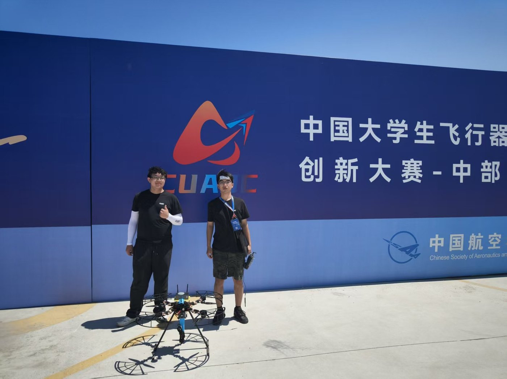
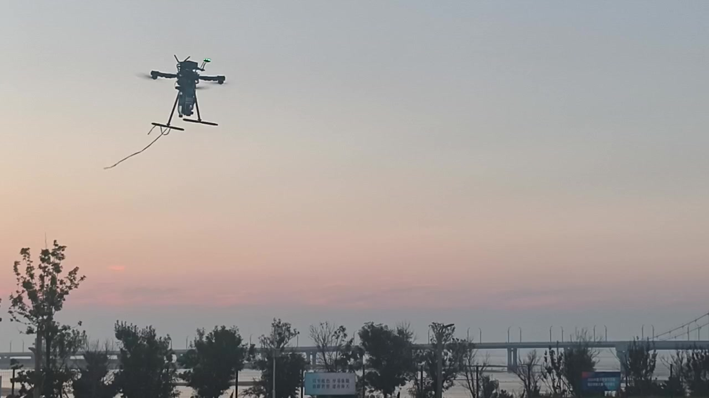
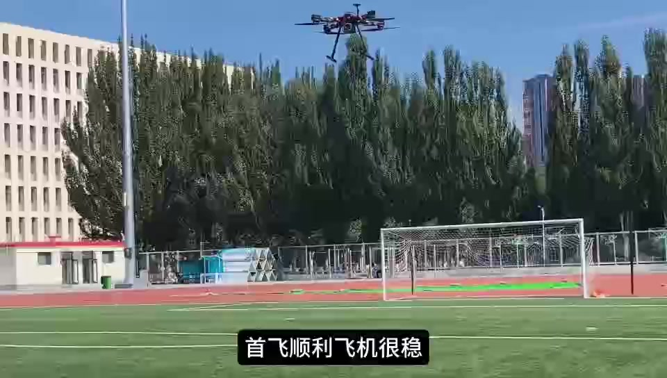
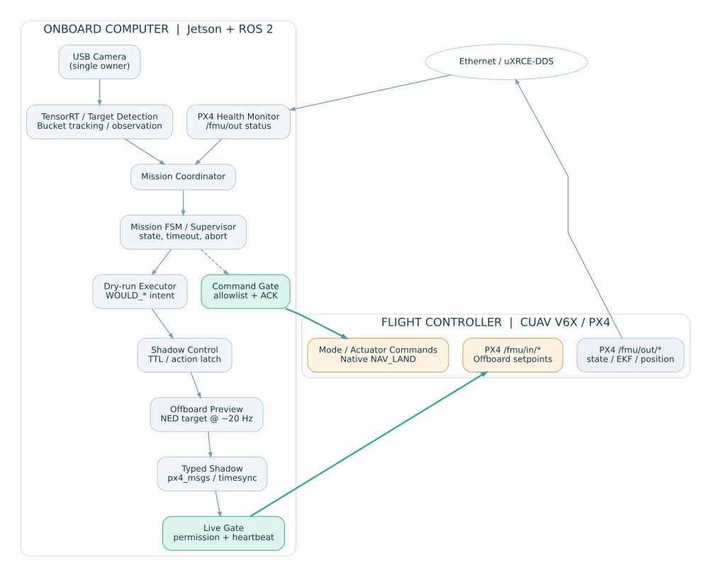
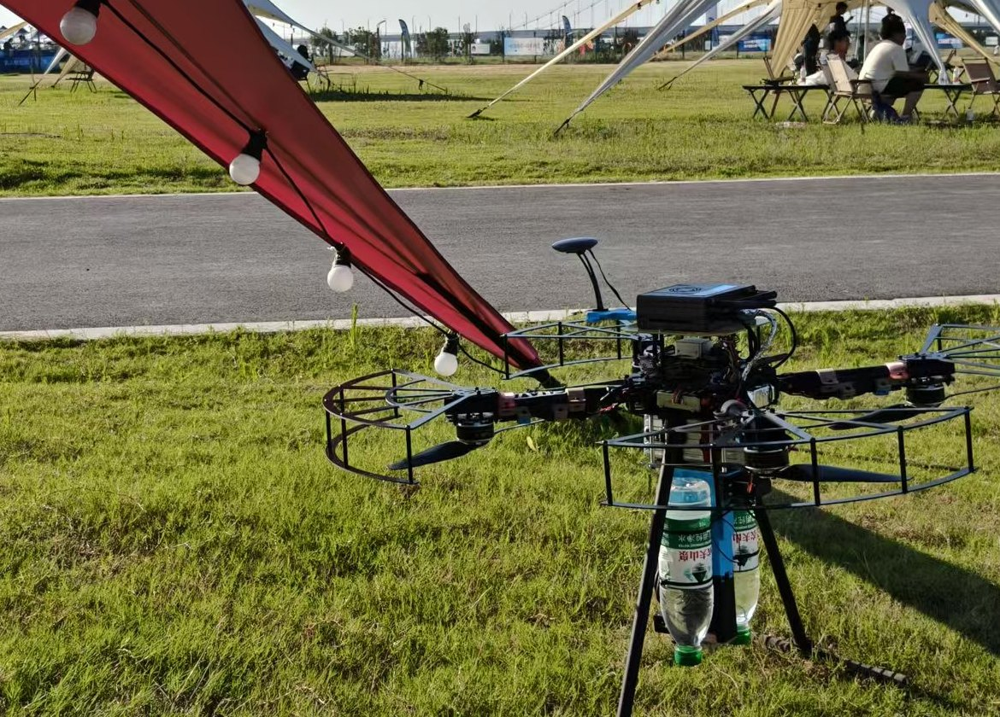
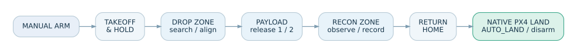
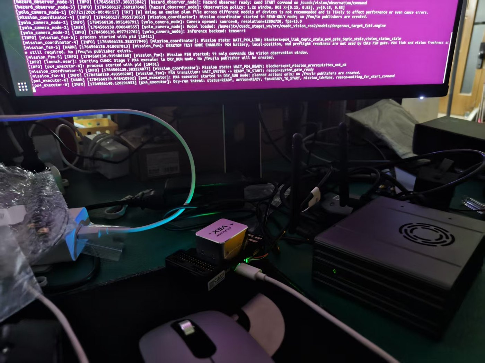
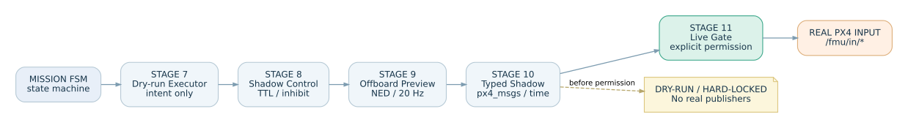
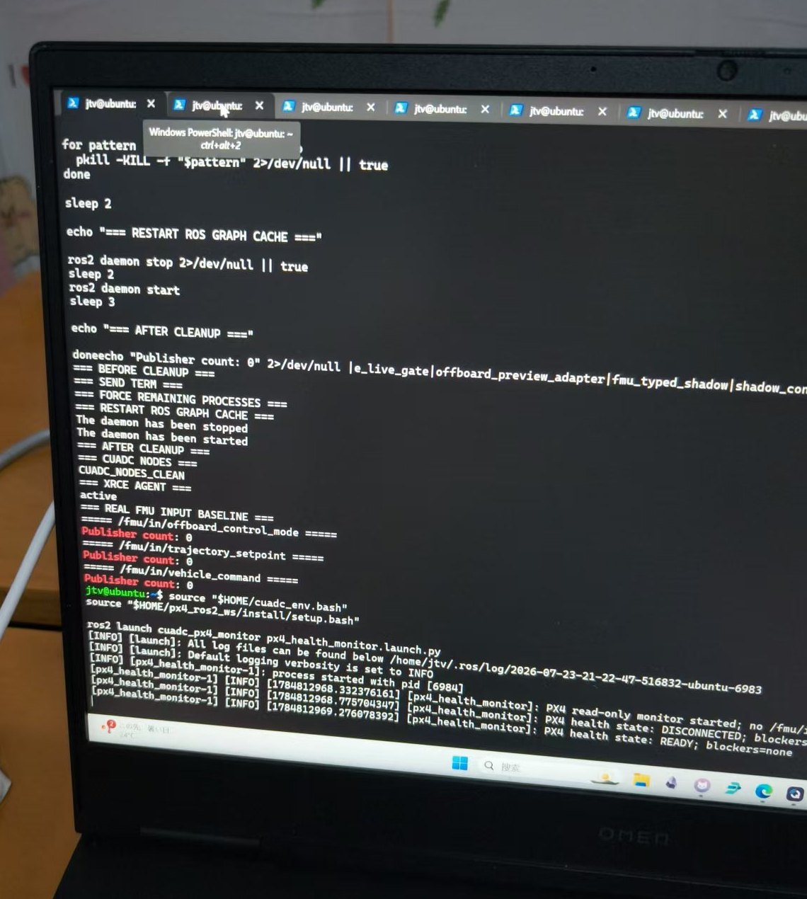
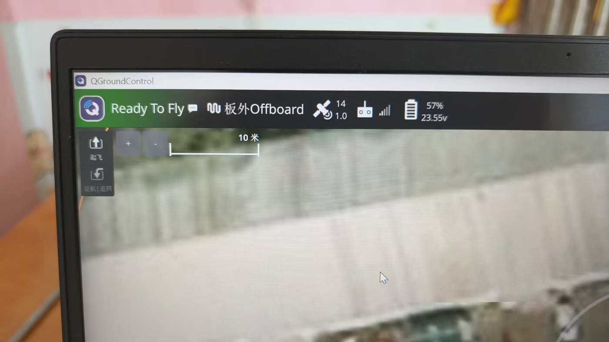

# CUADC 2026｜PX4 + ROS 2 自主无人机任务系统

**队长 / 系统主要开发者 · 2 人团队 · 20 天集中开发**

`PX4 1.17` · `CUAV V6X` · `Jetson Orin Nano Super` · `ROS 2 Humble` · `uXRCE-DDS` · `Offboard` · `TensorRT` · `Mission FSM`

我带领一支两人团队，在约 20 天内完成面向 **CUADC 2026 多旋翼侦察与救援任务**的飞行平台、机载计算、ROS 2 自主任务系统与现场联调。**除投掷机构的机械结构设计由另一名队员承担外，系统方案、任务软件、飞控与机载计算机集成、视觉与投放软件联动、调试和飞行验证均由我负责。**

我在 PX4、ROS 2 和现成传感器/推理框架之上开发与集成应用系统，并不将 PX4 内核或第三方组件声称为个人原创。

**最终成果：已实现完整赛道飞行，并保留连续的飞行视频。** 下方是这一版作品集的实拍素材，后文展示我实际设计和验证过的任务状态机、全影子链路及真实控制安全门。



> **项目说明：** 本仓库是公开的 **Engineering Portfolio（工程作品集）**，不是源码发布仓库。任务程序仍用于持续迭代和下一届队员交接，所以暂不公开内部 ROS 2 源码、部署脚本、参数文件及完整交接日志。

## 01 · 完整赛道飞行与开发影像

### 完整赛道飞行 · 连续实拍（1 分 51 秒）

[](media/flight/full-course-flight.mp4)

**[▶ 查看完整赛道飞行视频（MP4）](media/flight/full-course-flight.mp4)**

我保留了这段连续拍摄的现场飞行画面：视频中可以看到无人机起飞、空中飞行、场地内移动以及末段返回接近地面的过程。**“完整赛道已实现”是我的最终项目成果确认；视频不能单独证明的识别、投放等任务内部状态，不通过画面猜测或补写。** 详细技术链路见下文。

### 从零到一 · 原版开发纪实（2 分 15 秒）

[](media/development/development-journey-original.mp4)

**[▶ 观看原版开发纪录视频（MP4，含原始字幕及声音）](media/development/development-journey-original.mp4)**

这是我保留的原版开发纪录，记录了装机、首飞、视觉模型部署、系统调试与赛场经历。我选择保留完整视频的叙述、字幕与声音，而不是只截取成功画面；它更能还原两人团队在 20 天集中开发中的实际过程。**视频内关于赛场经历的叙述对应制作时的阶段性记录，不应视作整个项目后来成果的最终状态；最终完整赛道飞行展示以上方的连续实拍视频为准。**

## 02 · 两人、20 天：我实际承担的工作

这个项目的重点不是“我用过 PX4”，而是我如何在有限时间内把**飞行器、机载计算机、任务状态机、视觉与执行机构**组织成能够逐步验证并进入实飞的系统。

| 工作方向 | 我的具体工作 |
| --- | --- |
| **队长与系统方案** | 规划开发顺序、分级验收和试飞安排，组织现场联调、配置管理、开发日志与跨届交接。 |
| **PX4 + Jetson 集成** | CUAV V6X、Jetson 以太网、uXRCE-DDS / `px4_msgs` 通信、状态监控、模式与数据有效性判断。 |
| **ROS 2 自主任务软件** | Mission Coordinator、任务 FSM / Supervisor、Dry-run Executor、Shadow Control、Preview、Typed Shadow、Live / Command Gate 的设计与联调。 |
| **航线与控制** | NED 位置目标、目标锁存、限速、阶段稳定判定、Offboard 切换、受控退出和 PX4 原生 Land 交接。 |
| **视觉与投放联动** | TensorRT 识别链路、共享相机、观察窗口、桶跟踪、载荷舵机命令和顺序/ACK 控制。 |
| **整机验证** | 地面全影子、无桨台架、带桨短距离测试、双载荷短场任务、现场完整赛道飞行与记录整理。 |

**团队分工边界：** 另一位队员负责**投掷机构机械结构设计**；我负责与该机构配套的软件控制、接口联调以及整机任务集成。这是基于 PX4 的应用开发与系统集成工程，不是从零自制 PX4 内核或 TensorRT 框架。

## 03 · 飞控、机载计算与任务系统架构

我采用 **PX4 负责飞行器底层稳定、估计和原生飞行模式；Jetson + ROS 2 负责感知、任务决策和受限 Offboard 目标** 的架构。这样既发挥现有飞控能力，又能把任务执行权放在可检查、可接管的边界内。



**主要通信路径：**

- 飞控状态：`CUAV V6X / PX4 → Ethernet + uXRCE-DDS → /fmu/out/* → PX4 Health Monitor`。
- 感知任务：`USB 相机 → TensorRT 识别 / 桶跟踪 → Mission Coordinator → Mission FSM`。
- 连续控制：`FSM → Dry-run Executor → Shadow Control → NED Preview → Typed Shadow → Live Gate → /fmu/in/*`。
- 离散命令：**Command Gate 独立于连续设定值流**，按许可范围管理模式和执行机构命令，并检查回执。

其中 `/fmu/out/*` 是**状态反馈**，`/fmu/in/*` 是**潜在真实控制输入**。我把“上位机能够计算目标”和“目标被允许发送给飞控”分开，而不是直接让上游视觉节点控制无人机。

### 真实机体与载荷集成



[查看赛场实机完整照片](media/hardware/aircraft-at-field.jpg)

整机实际集成了 CUAV V6X 飞控、Jetson 机载计算平台、外部导航/传感器、任务相机、无线通信及双瓶载荷机构。照片展示的是实际测试平台，并非渲染图。投掷机构的机械结构由队友设计，我负责软件驱动及任务控制集成。

## 04 · Mission FSM：从观测到赛道完整任务

我没有把“识别到了目标”直接等同于执行投放，而是先将任务生命周期拆为**状态、事件、确认条件与异常退出**。

早期观测 FSM 包含 `IDLE → READY_TO_START → OBSERVING → TARGET_CONFIRMED → RESULT_RECORDED → COMPLETE`，并处理未检出、超时、`SAFE_HOLD`、`ABORTED` 和重置。`mission_id` 与 `command_token / request_token` 用于关联任务身份和回执；针对 ROS 2/DDS 发现窗口内的一次性命令丢失，我对同一 token 做了有界幂等重试与状态确认。

随着赛道任务展开，我将完整流程分为**起飞、前往投放区、搜索/对准、双载荷释放、侦察观察、返航、原生降落**等阶段：



开发日志中记录的 **GROUND_FULL_DRYRUN** 任务序列如下（地面验证阶段，不等同于最终实飞逐节点日志）：

```text
READY_TO_START → TAKEOFF → TRANSIT_TO_DROP_ZONE
→ SEARCH_DROP_TARGETS
→ ALIGN_DROP_1 → RELEASE_PAYLOAD_1 → VERIFY_RELEASE_1
→ ALIGN_DROP_2 → RELEASE_PAYLOAD_2 → VERIFY_RELEASE_2
→ TRANSIT_TO_RECON_ZONE → SEARCH_RECON_TARGETS
→ OBSERVE_HAZARD → TARGET_CONFIRMED → RESULT_RECORDED
→ RETURN_HOME → LAND → COMPLETE
```

我将**当前阶段、目标锁存、阶段超时、任务中断和控制权交接**作为不同职责处理。地面 Dry-run 中的部分任务事件为合成触发，用于先验证状态顺序；真实飞行任务则在具备控制资格后，使用经过现场验证的航线与载荷控制逻辑。

### 终端实拍：FSM 与 Executor 联调



这张原始调试照片中可以看到 `mission_fsm`、`mission_coordinator`、`px4_executor`、`READY_TO_START` 等运行信息，以及 **DRY_RUN** 和不创建真实 FMU 输入 Publisher 的说明。这是**地面软件联调**的证据，不冒充带桨飞行结果。

## 05 · 全影子链路：先验证，再开放真实控制

这是我在软件架构上投入最多精力的部分之一。为降低跨设备联调风险，我把“任务认为应该做什么”与“飞控实际接收到什么”之间设置了逐级可验证的边界。



| 组件 | 我设计它解决的问题 | 关键验证点 |
| --- | --- | --- |
| **Mission FSM** | 任务身份、状态推进、超时与取消 | 任务 token、状态回执、`SAFE_HOLD / ABORTED` |
| **Stage 7 · Dry-run Executor** | 先把状态变成 `WOULD_*` 执行意图 | 没有任何真实飞控输入发布 |
| **Stage 8 · Shadow Control** | 生成结构化控制请求，保证上游目标有效 | TTL、新鲜度、动作锁存、异常抑制 |
| **Stage 9 · Offboard Preview** | 按 NED 坐标组织连续目标 | 约 **20 Hz**，位置、Yaw 和限幅检查 |
| **Stage 10 · Typed Shadow** | 转换为真实 `px4_msgs` 类型但不执行 | 时间同步、配对时间戳、NaN 策略、消息合法性 |
| **Stage 11 · Live Gate** | 只有满足条件才可能创建真实设定值发布器 | 默认硬锁定、启动许可、心跳及断流保护 |
| **VehicleCommand Gate** | 与连续轨迹独立管理模式/执行机构命令 | 白名单、单次动作预算、ACK 验证 |

开发日志给出明确的阶段性验证结果：预览与类型化影子设定值曾保持约 20 Hz 输出，Typed Shadow 测试记录了 **22.10 Hz** 的流率；在全影子和硬锁定测试中，真实 `/fmu/in` 发布器数量为零。**这里的频率是相应测试阶段的观测值，不是对所有实飞架次的绝对性能承诺。**

### 终端实拍：真实 PX4 输入隔离



照片中可见以下话题在该次地面验证中的 `Publisher count: 0`：

```text
/fmu/in/offboard_control_mode  : 0
/fmu/in/trajectory_setpoint    : 0
/fmu/in/vehicle_command       : 0
```

这张截图直接证明了**当次地面调试的真实输入隔离状态**；配合开发日志中的 Preview / Typed Shadow / Live Gate 审计记录，共同说明分层验证策略，而不是用照片单独证明所有安全机制。

## 06 · 视觉识别、任务联动与载荷控制

**视觉链：** USB 相机 → TensorRT YOLO → 检测与 ROI 筛选 → 桶目标跟踪 / 侦察观测窗口 → Mission Coordinator。观测任务曾采用约 1.2 秒窗口、多帧汇总与任务身份约束，避免把某一帧检测直接视为最终任务结果。

**共享相机：** 由 `yolo_camera_node` 单独打开摄像头并发布 `/cuadc/camera/raw`，`bucket_tracker_node` 订阅图像，解决多个节点争用同一相机的问题。

**载荷链：** 飞控 AUX5 配合 `MAV_CMD_DO_SET_ACTUATOR`（187），按 `ZERO → RELEASE_1 → RELEASE_2` 的命令顺序完成软件控制；不同动作经过许可/回执检查。**ACK 表示飞控接收命令，不能单凭 ACK 推断载荷物理释放成功。**

**降落交接：** 我优先使用 PX4 原生 `NAV_LAND → AUTO_LAND`，再通过 landed / disarmed 状态确认收尾，而不是让上位机持续发送“下降到起点”的设定值并把它当作真正的 Land 模式。

### 辅助运行截图：QGroundControl



上图只用于展示 PX4 / QGroundControl 的现场状态监控，不将一张状态截图当作整条赛道的执行证明。

## 07 · 工程验证与最终成果

我采用**桌面影子 → 无桨台架 → 带桨受限飞行 → 真实载荷短场 → 完整赛道**的分级验证方式，把软件可运行、控制消息正确、整机飞通分别确认。

| 验证阶段 | 可公开的结果 |
| --- | --- |
| **PX4 ↔ Jetson 通信** | 以太网、uXRCE-DDS、ROS 2 的 PX4 输出话题与冷启动通信恢复已建立。 |
| **GROUND_FULL_DRYRUN** | 完整赛道 FSM 地面状态顺序 PASS；命令 token / ACK 可靠性回归；真实输入 Publisher 维持为 0。 |
| **受限 Offboard 飞行** | 程序起飞、悬停、约 1.5 m 单轴位移与原生 Land / 自动上锁曾逐级完成带桨验证。 |
| **2026-08-05 双载荷短场** | 日志记录两次真实舵机命令、固定航点、侦察短路线、返航、`NAV_LAND → AUTO_LAND` 与自动上锁的任务闭环。 |
| **最终完整赛道** | 我确认已完成完整赛道飞行，并提供连续原始飞行视频作为公开展示。视频仅说明拍摄可见的飞行过程，不额外声称未能从影像确定的任务指标或比赛名次。 |

以上具体测试结果均有我保留的阶段开发日志作为依据。**阶段日志反映的是当时的调试快照；对后续完整赛道的成果，以我提供的连续飞行视频与最终确认作为展示依据。**

## 08 · 公开范围与项目延续

程序仍在迭代，并且需要交给下一届队员继续维护，所以目前不公开完整 ROS 2 任务源码、部署脚本、比赛参数和内部交接资料。本仓库仅公开我实际负责的**系统设计思路、工程技术链路、阶段验证结果以及真实图片/视频**。

**我希望这份作品集展示的是：**我作为两人团队队长，在 20 天的集中周期里，如何把 PX4、ROS 2、Jetson、视觉、任务 FSM、全影子安全链和真实执行机构组织起来，并推进到现场完整赛道飞行。这比单独介绍某个算法或节点，更接近我实际做过的系统工程工作。
