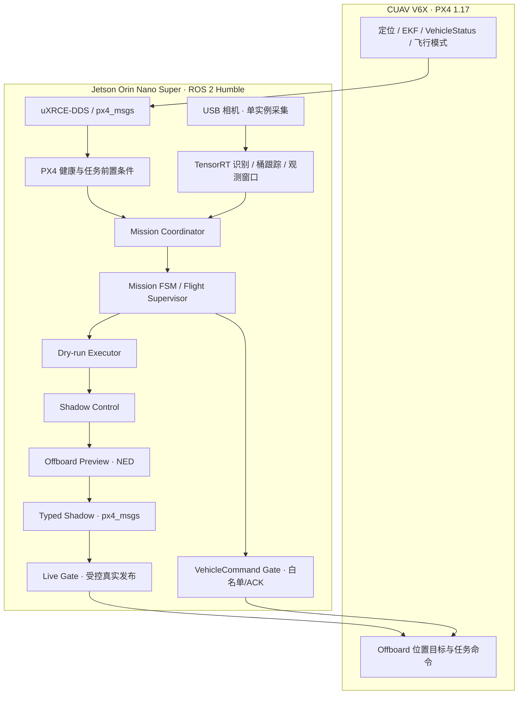
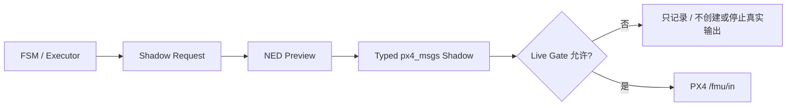

# CUADC 2026｜PX4 + ROS 2 多旋翼自主任务系统

**20 天 · 2 人团队 · 队长 / 系统设计、开发与飞行集成**

`CUAV V6X` · `PX4 1.17` · `Jetson Orin Nano Super` · `ROS 2 Humble` · `uXRCE-DDS` · `Offboard` · `TensorRT`

> **项目定位**：我带领一支两人小队，在约 **20 天**的集中开发周期内，完成了面向 CUADC 2026 多旋翼侦察与救援任务的飞行平台集成、自主任务软件、分层控制链、视觉与载荷协同，以及现场测试。**我担任队长，负责除投掷机构机械结构设计以外的整体系统开发与联调；另一名队员负责投掷机构的机械结构设计。** 投放动作的软件控制、飞控接口和任务流程集成由我完成。
>
> 这里的“开发”是指在 **PX4、ROS 2 和现有硬件/视觉组件基础上进行自主任务软件开发与系统集成**，不代表从零开发 PX4 飞控内核或第三方识别框架。

**最终展示成果：我已完成完整赛道飞行，并保存了对应的完整飞行视频。** 视频将整理后放入仓库；此前开发日志主要反映阶段调试和赛场测试过程，不用某一份阶段记录代替后续最终成果。这里不声明未经视频或记录确认的竞赛名次、全程视觉闭环效果或其他额外指标。

**[项目架构](#02--整体系统架构)** · **[任务状态机](#03--任务状态机从观测流程到完整赛道)** · **[全影子链路](#04--全影子链路shadow-pipeline与安全门)** · **[真实验证](#06--我完成的实际验证)** · **[公开范围](#08--关于源码与资料公开)**

## 01 · 我负责了什么

这是一个两人规模、时间非常紧的系统集成项目，因此我从方案规划一直跟进到现场运行，而不只是编写其中一个 ROS 2 节点。

| 工作范围 | 我的具体工作 |
| --- | --- |
| **项目负责人 / 队长** | 制定开发顺序与任务优先级，组织飞行准备、分级验收、现场联调与交接记录；在有限时间内优先打通可运行的最短闭环。 |
| **飞控与机载计算机集成** | 完成 CUAV V6X/PX4 与 Jetson 的以太网、Micro XRCE-DDS、ROS 2 话题链路和配置持久化，联调定位、遥控、传感器状态与控制模式。 |
| **ROS 2 任务系统** | 组织健康监控、视觉观测、任务协调器、任务 FSM、Dry-run Executor、Shadow/Preview/Typed Shadow、Live Gate 与 Command Gate。 |
| **自主控制与航线** | 设计并联调当前点锁存、NED 轨迹目标、限速位移、任务阶段切换、Offboard 模式管理及 PX4 原生降落交接。 |
| **视觉与载荷软件** | 集成 USB 相机、TensorRT 目标识别、共享图像、桶目标跟踪与观察窗口；完成投放指令顺序、舵机输出接口和任务联动。 |
| **测试与工程记录** | 完成台架、影子链、带桨飞行和载荷飞行的逐级联调；整理 ROS 2 运行记录、PX4 状态与 ULog，形成后续队员可接手的工程资料。 |

**分工边界**：投掷机构的**机械结构设计**由另一位成员承担；上表描述的是我实际负责的软件、控制接口、整体集成和测试工作。为避免误解，PX4、ROS 2、HAL、TensorRT 等已有项目与框架不作为我原创的底层软件成果。

## 02 · 整体系统架构

我采用 **PX4 负责飞行器底层稳定与状态估计，Jetson/ROS 2 负责感知、任务决策和受限 Offboard 目标生成** 的分工。核心不是把所有模块连到一个大节点，而是让每一步都有独立的输入、状态和检查点。



主要设计决策：

- **数据与执行分离**：`/fmu/out/*` 用于读取飞控健康、模式和位置；只有显式通过 Live Gate / Command Gate 的链路才允许访问 `/fmu/in/*`。
- **任务与控制解耦**：FSM 描述“当前处于什么任务阶段”，Executor/Shadow 描述“下一步希望执行什么”，Preview/Typed Shadow 负责“目标数值和消息是否正确”。
- **优先沿用 PX4 原生控制能力**：上位机生成受限位置目标并管理任务状态，着陆阶段交还 PX4 原生 `NAV_LAND / AUTO_LAND`，避免把上位机下降设定值误当成完整着陆过程。
- **逐级开放执行权限**：先在桌面/无桨环境验证任务顺序、消息和异常抑制，再开放真实 Offboard 输入与带桨测试。

## 03 · 任务状态机：从观测流程到完整赛道

### 3.1 早期观测 FSM：把“看到目标”变成可确认的任务结果

最初我把观测过程设计成独立状态机，用于验证目标观测窗口、任务身份、确认保持时间、超时和人工中断，而不是让识别结果直接触发飞控动作。

```text
IDLE ──prepare──> READY_TO_START ──start──> OBSERVING
                                │
                                ├─ 有效观测 → TARGET_CONFIRMED
                                │              ↓
                                │        RESULT_RECORDED → COMPLETE
                                └─ 无有效目标 → READY_TO_START
任意允许阶段：异常/数据超时 → SAFE_HOLD；operator abort → ABORTED
```

这一层的关键处理包括：

- **任务身份**：通过 `mission_id`、`request_token / command_token` 区分不同任务和命令回执。
- **重复命令幂等**：考虑 ROS 2/DDS 初次发现阶段单次命令可能丢失，CLI 在限定时间内重复发送相同 token，直到收到匹配确认；`reset / prepare / start` 曾完成连续三轮可靠性回归。
- **新鲜度与中断语义**：对协调器、视觉观测和下游请求设置超时，输入不再更新时进入 `SAFE_HOLD / INHIBITED`，避免使用旧目标继续推进。
- **只做任务决策**：这一阶段不会创建真实 PX4 控制输入 Publisher，因此可以独立验证状态机本身。

### 3.2 赛道 FSM：把起飞、投放、侦察、返航拆成可观测阶段

随后我把流程扩展为完整赛道任务。2026-07-28 的 `GROUND_FULL_DRYRUN` 已经在**不驱动飞控与机构**的情况下完成整套状态顺序验证：

```text
READY_TO_START
  → TAKEOFF
  → TRANSIT_TO_DROP_ZONE
  → SEARCH_DROP_TARGETS
  → ALIGN_DROP_1 → RELEASE_PAYLOAD_1 → VERIFY_RELEASE_1
  → ALIGN_DROP_2 → RELEASE_PAYLOAD_2 → VERIFY_RELEASE_2
  → TRANSIT_TO_RECON_ZONE
  → SEARCH_RECON_TARGETS → OBSERVE_HAZARD → OBSERVING
  → TARGET_CONFIRMED → RESULT_RECORDED
  → RETURN_HOME → LAND → COMPLETE
```

我将**航点到达/稳定保持、释放动作确认、观察窗口结果、返航与着陆交接**划分为不同的阶段与条件。地面 Dry-run 中的部分投放和识别事件使用合成触发，目的是验证顺序与上下游接口，**并不等同于当时就完成了真实视觉闭环**。后续实飞则采用经过现场验证的航线/载荷配置逐级开放动作。

### 3.3 飞行执行层：轨迹、载荷与降落的状态交接

在真实短场双载荷任务中，任务执行按 **人工 Arm → Offboard → 起飞 → 投放区域 → 两次载荷释放 → 侦察短航线 → 返航 → 原生 Land → 自动上锁** 的顺序运行。这里的 `HOLD`、`DROP_SCAN_LINE`、`HOME_APPROACH` 等是飞行执行层的具体航段/阶段，和前面的早期桌面观测 FSM 不是完全相同的一套状态名称。

我重点处理了三个连接点：**轨迹到位和稳定后才进入下一阶段、载荷指令必须按顺序确认、控制权在原生 Land 时正确释放**。

## 04 · 全影子链路（Shadow Pipeline）与安全门

这是我在项目中投入较多精力的一部分。为了避免首次联调就让视觉结果直接驱动飞机，我把任务意图到真实飞控输入拆成多个可以分别审计的层次。

| 层级 | 实际作用 | 调试时可验证什么 |
| --- | --- | --- |
| **Mission FSM** | 管理任务阶段与状态回执 | 状态转移、任务身份、超时、SAFE_HOLD / ABORT |
| **Stage 7 · Dry-run Executor** | 把 FSM 转成 `WOULD_...` 执行意图 | 不接 PX4 时，任务顺序及操作意图是否正确 |
| **Stage 8 · Shadow Control** | 把意图变为结构化 `control/request` | TTL、新鲜度、动作锁存、异常优先级 |
| **Stage 9 · Offboard Preview** | 生成约 **20 Hz** 的 JSON/NED 目标预览 | 位置、Yaw、限速、坐标与目标锁存 |
| **Stage 10 · Typed Shadow** | 转换为实际 `px4_msgs` 数据结构 | 类型、PX4 微秒时间戳、成对消息一致性、未使用字段 NaN |
| **Stage 11 · Live Gate** | 在允许时向真实 `/fmu/in/*` 发布设定值 | 启动硬权限、心跳、状态门控、停流 |
| **VehicleCommand Gate** | 管理模式及载荷等离散命令 | 白名单、命令预算、一次性动作、token 与 PX4 ACK |



**这条链路的价值不是多做几层包装，而是把“代码能生成目标”和“飞机真的被允许执行”明确隔开。**

- **默认硬锁定**：在早期 Stage 11A 验证中，`allow_fmu_publishers=false` 时不创建真实输入 Publisher。地面全影子回归中，三条 `/fmu/in` 输入的 Publisher count 均为 0。
- **预览与真实发布分开**：Typed Shadow 的正确 `OffboardControlMode` / `TrajectorySetpoint` 仍先发布到 `/cuadc/fmu_shadow/in/*`，通过审核后才开放到真实输入。
- **时间与状态有效性**：检查 PX4 timesync、消息配对、上游新鲜度和连续心跳；异常或停流按相应阶段配置抑制输出，不依靠一条未经校验的旧设定值继续运行。
- **离散命令不混入设定值通道**：模式切换和载荷动作经独立 Command Gate，采用白名单与 ACK 校验；程序不自主发送 ARM/DISARM/KILL。

这部分的程序节点和策略经历过多轮迭代：**表中层次是实际开发与验证过的设计脉络，不表示所有阶段的测试参数原封不动地用于每一架真实飞行。**

## 05 · 视觉、任务与载荷的实际集成

### 视觉链

我将 **USB 相机 → TensorRT 推理 → 目标筛选/跟踪 → 观测窗口 → Mission Coordinator** 接到任务决策层：

- 早期危险品观测采用 ROI、约 **1.2 s** 观测窗口和多帧结果汇总，避免将单帧检测直接当作任务完成。
- 共享相机改造后，由一个 `yolo_camera_node` 负责打开设备并发布 `/cuadc/camera/raw`；`bucket_tracker_node` 订阅同一图像，避免两个节点争用同一 USB 相机。
- 桶目标跟踪与侦察观察是**不同的任务功能**；其地面识别、Dry-run 和真实飞行证据分别记录，不用台架视觉 PASS 直接替代空中视觉闭环结论。

### 载荷链

另一名成员设计了投掷机构的机械结构；我负责将它作为受限执行机构接入飞控控制链。记录中使用 **V6X AUX5 + `MAV_CMD_DO_SET_ACTUATOR`（187）** 完成舵机控制，通过 `ZERO → RELEASE_1 → RELEASE_2` 的顺序门和 ACK 验证控制流程，并在真实双载荷短场飞行中完成投放链路和原生降落。

我尤其注意**软件 ACK 表示命令被 PX4 接受，并不等同于载荷物理释放已经得到视觉确认**；因此在作品集中，命令记录和飞行画面会分别展示各自能证明的内容。

## 06 · 我完成的实际验证

| 阶段 | 可展示的结果 | 证据边界 |
| --- | --- | --- |
| **通信联调** | V6X ↔ Jetson 以太网、uXRCE-DDS、ROS 2 PX4 状态订阅与冷启动恢复 | 实际台架与现场连通记录 |
| **全影子链** | 完整任务顺序 `GROUND_FULL_DRYRUN=PASS`，命令可靠性三轮回归，真实 PX4 输入 Publisher 为 0 | 地面软件验证，非带桨飞行 |
| **受限 Offboard 飞行** | 程序起飞/悬停、两次约 **1.5 m** 前进测试、原生 Land 与自动上锁 | 带桨分阶段飞行 |
| **双载荷短场任务** | **2026-08-05** 两次载荷释放命令、固定航点、侦察短路线、返航、`NAV_LAND → AUTO_LAND` 和自动上锁 | 开发日志明确记录的实飞 PASS |
| **完整赛道飞行** | **我已完成完整赛道，并保留全程飞行视频** | 这是我后续补充的最终成果；视频尚未加入本仓库，具体动作以原片为准 |

上述数据来自我保留的最终开发日志及本人对后续完整赛道成果的补充，不将“地面仿真通过”“短场飞行通过”“完整赛道飞行”混为同一测试。

## 07 · 飞行视频与工程影像

我保存了完整赛道视频，以及部分现场装机、台架、视觉和飞行调试素材。**本仓库将只放可以直接对应实际工程的原始画面和简短说明**，不使用虚构效果图或以其他项目的飞机冒充本项目。

视频与照片尚在整理中；上传后此处将更新为可点击封面和对应文件。为了便于快速阅读，优先展示：

1. **完整赛道飞行**：连续画面，注明该视频实际出现的任务环节。
2. **整机/机载系统**：V6X、Jetson、相机、布线和载荷装机照片。
3. **软件联调**：状态机、ROS 2 话题、视觉观测/跟踪或地面 Dry-run 的真实截图。

## 08 · 关于源码与资料公开

**本仓库是 Engineering Portfolio（公开工程作品集），不是可直接部署的源码仓库。** 任务程序仍在迭代，并需交接给下一届队员继续开发和维护，因此现阶段不公开 ROS 2 任务源码、部署脚本、比赛参数、完整内部日志和可直接复用的任务配置。

公开的技术内容以我保存的 **CUADC 2026 最终开发日志（V1.17）** 所记录的信息为基础，并补充我本人确认的**两人团队 / 20 天 / 队长与个人职责 / 后续完整赛道飞行**等项目事实。保留作品集展示，不代表放弃团队对未公开代码和资料的权利。

---

**我希望这个项目展示的能力**：在紧张的开发周期中，能把复杂的跨设备机器人系统拆成可观察、可验证、可逐步开放真实控制权的模块，并最终推进到无人机实际任务飞行。这个项目对我而言，不只是使用 PX4 或 ROS 2，而是从架构设计、系统实现到现场联调的完整工程实践。
