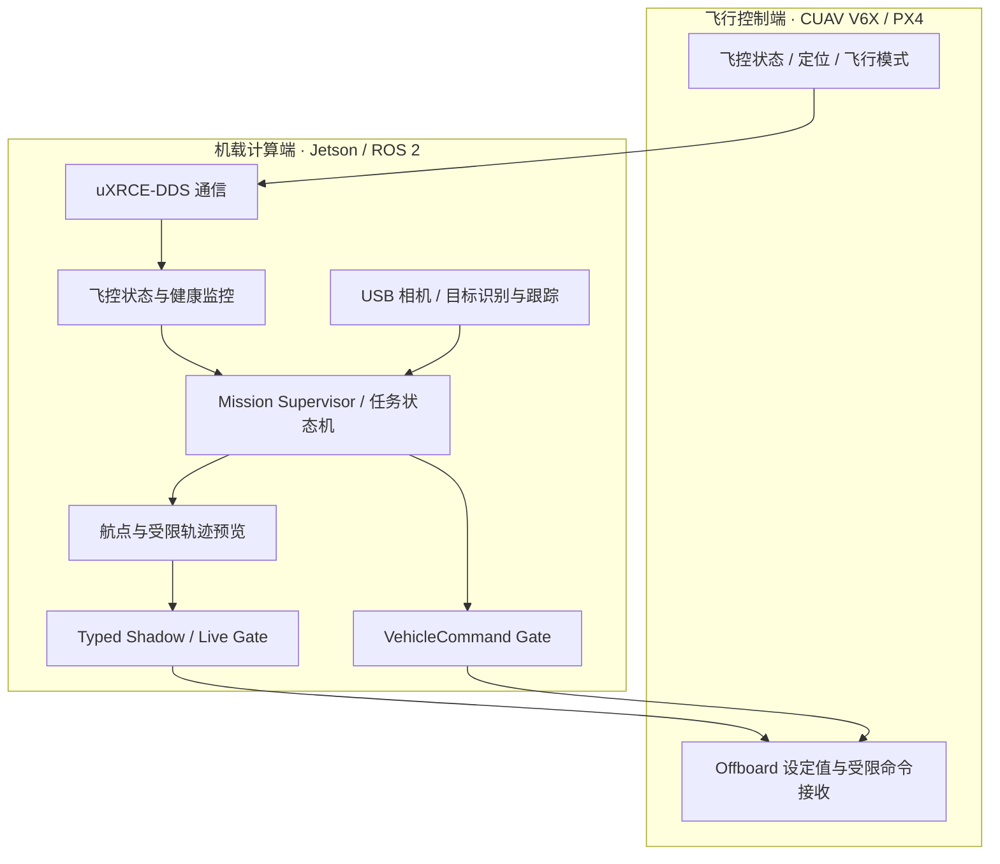

# CUADC 2026｜PX4 + ROS 2 多旋翼自主任务系统

**Autonomous UAV Mission System · Engineering Portfolio**

**PX4 1.17 · CUAV V6X · Jetson Orin Nano Super · ROS 2 Humble · uXRCE-DDS · Offboard · TensorRT**

我参与开发了面向 **CUADC 2026 多旋翼侦察与救援任务** 的自主飞行与任务执行系统，主要围绕 Jetson 与 PX4 飞控之间的通信、ROS 2 软件模块、Offboard 轨迹控制、视觉任务协同和飞行测试展开工作。

在这套系统中，我希望解决的不只是“让无人机按航点飞行”，还包括如何把飞控状态、视觉观测、任务决策、控制指令与载荷动作组合成一条可监控、可调试、可逐级验证的工程链路。

**项目成果：我已完成完整赛道飞行，并保留有对应的全程飞行视频。** 目前日志主要记录各阶段开发和赛场调试情况，作品集将以最终完成的赛道飞行成果为主线；视频整理后补充到首页。

> **公开说明 / Source Availability**：本仓库是对外公开的**工程作品集**，不是可下载运行的源码开源项目。由于 CUADC 任务系统仍需继续迭代，且相关程序与配置需要交接给下一届队员维护和完善，我现阶段不公开 ROS 2 任务源码、完整部署工程、比赛配置和控制参数。
>
> 本作品集的技术描述以我保留的 **CUADC 2026 最终开发日志（V1.17）** 为依据，成果展示另结合我保存的真实飞行视频与调试影像。日志属于内部交接资料，不在仓库中全文公开；这里仅整理适合对外展示的项目架构、本人工作和测试成果。项目代码是否在未来开放，将结合团队安排与后续迭代情况决定。

## 01 · 完整赛道飞行展示

我已经保留了完整赛道飞行的原始视频，将在整理素材后添加下列展示：

- **完整赛道飞行视频**：作为首页主要展示内容，保留真实飞行顺序和现场状态。
- **机体与机载系统照片**：展示 CUAV V6X、Jetson、视觉相机与载荷机构等集成形态。
- **任务调试影像**：结合视频和照片说明航点任务、视觉流程及载荷测试。

<!-- 取得视频及封面后，替换本注释为可点击的真实视频封面；不要使用示意图冒充实飞。 -->

项目记录还保存了多个阶段的飞行成果，包括程序起飞与悬停、短距离位置控制、固定航点任务、真实双载荷投放及 PX4 原生降落。**完整赛道展示和各子模块测试会分开标注，不用某一段短场测试替代全程实飞视频。**

## 02 · 我搭建的 PX4 + ROS 2 软件架构

这套链路将“**状态读取 → 任务决策 → 目标生成 → 消息适配与门控 → 飞控执行**”分层处理。我在调试中能够分别检查状态数据、预览目标和实际 PX4 输入，减少各功能同时上线时难以定位问题的情况。

## 03 · 我重点完成的工程工作

| 工程方向 | 我的工作内容 |
| --- | --- |
| **PX4 / Jetson 通信** | 配置以太网与 uXRCE-DDS，连接 PX4 `/fmu/out/*` 状态和 ROS 2 模块，并验证冷启动后的通信恢复。 |
| **Offboard 控制接入** | 组织当前点锁存、NED 目标生成、限速轨迹和连续设定值发布，完成模式切换 ACK 与原生 Land 交接。 |
| **任务状态机** | 将起飞、航点、投放区、侦察区、返航和降落组织为可观测的任务阶段，并为人工接管预留边界。 |
| **控制指令安全** | 区分 Preview / Typed Shadow / Live Gate，对模式切换、载荷和降落指令进行限制、顺序管理和确认。 |
| **视觉与载荷集成** | 接入 USB 相机、目标识别/跟踪与侦察观察流程，联调双载荷释放指令及任务阶段切换。 |
| **现场工程调试** | 结合 PX4、ROS 2 日志和现场对照测试，处理通信持久化、相机与 GNSS 共存、参数存储及多设备集成。 |

## 04 · 真实飞行与系统验证

以下是我在不同阶段保存的明确工程记录。不同记录对应不同测试条件，完整赛道飞行的视频将独立展示。

| 开发阶段 | 记录中的代表性成果 |
| --- | --- |
| 通信和地面联调 | PX4 ↔ Jetson 的 XRCE-DDS 链路、ROS 2 状态监控与 Offboard 指令门控完成台架验证。 |
| 短距离实飞 | 程序起飞、悬停、约 1.5 m 受限前进，以及向 PX4 原生 Land 交接。 |
| 航线与视觉集成 | 通用航点、任务状态机、桶目标跟踪和侦察视觉链路完成分阶段测试。 |
| 真实载荷短场飞行 | 2026-08-05 完成双瓶真实载荷、两次顺序释放、固定航点、返航、原生 Land 与自动上锁的短场闭环。 |
| **完整赛道飞行** | **已完成，保留全程飞行视频；待加入本仓库，并按视频真实内容补充具体动作及测试条件。** |

### 飞行记录如何呈现

我更倾向于保留完整或连续的原始测试画面，而不是只放几个剪切后的成功瞬间。每段视频会配上**测试目标、场地/阶段和可直接观察到的结果**，让观看者能够把软件架构与真实无人机行为对应起来。

## 05 · 这套系统让我积累的工程能力

- **跨设备软件集成**：在 PX4、Jetson、ROS 2、相机与执行机构之间建立相对清晰的接口和数据路径。
- **真实控制链路调试**：把状态、目标、命令确认和飞行模式组织成可检查的执行过程，而不是只看任务是否启动。
- **任务级系统设计**：将航点飞行、载荷动作和视觉观察纳入同一任务流程，并区分各阶段的测试范围。
- **工程测试和记录**：积累了从无桨 Bench、带桨短场到完整赛道的过程资料，便于复盘参数、检查系统行为及交接工作。

## 06 · 项目资料与展示范围

- **主要技术环境：** CUAV V6X / PX4 1.17、Jetson Orin Nano Super、ROS 2 Humble、uXRCE-DDS、QGroundControl、TensorRT / USB 相机。
- **展示依据：** 本人保存的开发日志、现场照片、调试视频与完整赛道飞行视频。其中日志多数记录的是各阶段调试状态，**不以单份赛场调试记录代替最终项目展示**。
- **公开范围：** 仅展示最终开发日志中已有的技术信息，以及我保存并选择公开的实际影像；出于后续迭代与队员交接需要，不提供任务源码、比赛参数或部署程序。本仓库不属于源码开源发行版。

本项目基于 PX4、ROS 2 及其他现有开源/第三方技术生态进行二次开发与工程集成。我展示的是自己实际参与完成的系统设计、软硬件联调和飞行任务实现。
